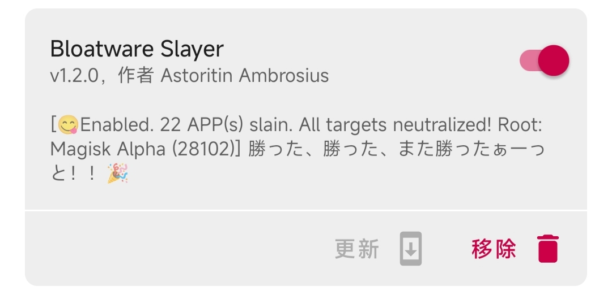
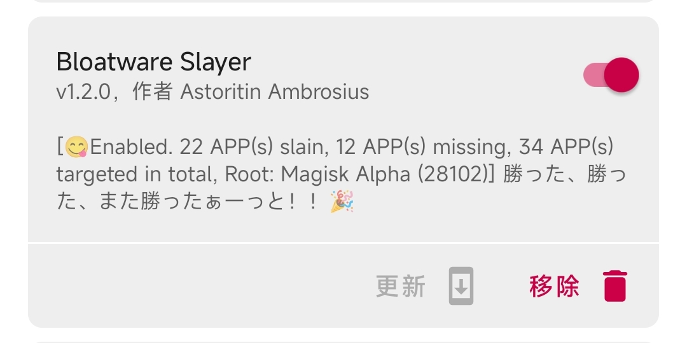

[简体中文](README.md) 丨 English  

# Bloatware Slayer / 干掉预装软件

A Magisk module to remove bloatware in systemless way
/ 一个无需修改 system 分区即可移除预装软件的 Magisk 模块

NOTICE

This Magisk module required devices with unlocked BootLoader and specific Root Modules Manager (Magisk/KernelSU/APatch).
This Magisk module WILL NOT be able to work if your device doesn't get root access or even unlock BootLoader.

## Support Root Implementation

- [Magisk](https://github.com/topjohnwu/Magisk) (Recommended!)
- [KernelSU](https://github.com/tiann/KernelSU) (Recommended!)
- [APatch](https://github.com/bmax121/APatch) (Theoretical support only, not tested yet)

## Details

This Magisk module deletes pre-installed bloatware in a Systemless manner through Magisk's mount method and specific mount methods for KernelSU and APatch. Here are the general steps for usage:

1. Install Magisk / KernelSU / APatch.
2. Download and install this module.
3. To obtain the directories/folders of the pre-installed bloatware, you need to do some preliminary research. 
For example, use App Manager or file explorers like Root Explorer and MiXplorer 
to manually locate and copy the folder names of the pre-installed apps in <code>/system</code>. 
4. Open <code>/data/adb/bloatwareslayer/target.conf</code>  
list the folder names of the pre-installed apps obtained in Step 3, **one per line**. 
5. Save the changes to target.conf, reboot your device and check the results.  

You can see the number of apps blocked by the module (slain), 
the number of apps not found (missing) 
and the total number of apps targeted in the module description.  

  
For example, if I want to uninstall XiaoAI (the voice assistant), I would use AppManager to check the folder name of XiaoAI and find out that it is <code>VoiceAssistAndroidT</code>. I would then copy <code>VoiceAssistAndroidT</code> to <code>target.conf</code>, press Enter to save the changes, and reboot the device. 

NOTICE

<ol>
<li><code>target.conf</code> supports commenting out entire lines with the "#" symbol. 
Bloatware Slayer will ignore commented lines and empty lines.</li> 
<li>You can also order custom paths, for example: <code>/system/app/MiVideo/</code>.</li> 
In this case, Bloatware Slayer will directly process the custom path without scanning other system folders.  
<li>Since most modern devices use SAR (System-as-root), the resource directory names you see in AppManager may not start with <code>/system</code> (for example,<code>/product/app/Scanner</code>). 
To ensure the mount works, manually add <code>/system</code> to the beginning of paths. Otherwise, Bloatware Slayer will ignore them.</li> 
<li>If the resource directory starts with <code>/data</code>, it means the app was installed as first booting after the initial of ROM setup. 
You can uninstall it manually and should not add it to <code>target.conf</code>, as Bloatware Slayer's processing will not affect such apps.</li> 
</ol>

 

Q: Why do I need to manually copy the folder names instead of letting the module detect the system directories based on the app names or package names?

**Firstly, the APP name and package name are not reliable, and relying on these two factors to locate the APP folder is extremely inefficient.**  
For most standardized ROMs, the probability of using languages other than English to name system directories/folders is extremely low.  
Moreover, there are quite a few APPs whose APP names have no relation to their system directory/folder names (whether due to the ROM provider's carelessness and lack of proficiency leading to non-standard naming details, or the sinister intentions of some apps that deliberately use non-standard naming to hide their user data collection activities). If one insists on matching them in this way, not only would a large amount of data analysis be required, but the error rate would still be quite high.  

*For example, there is an app named "System Service," but its directory/folder name is "AdPushService," and its package name is "com.android.adpromote."*  

Regarding package names, please refer to [**"Confirmed feature that will not be added: Detecting package names is permanently off the table"**](https://github.com/Astoritin/Bloatware_Slayer/issues/6#issuecomment-2693035556).  

**Secondly, although this module operates in a Systemless (non-system-modifying) manner, you must always know and be certain of what you are doing.** You need to know which system apps you should disable, **instead of blindly copying someone else's list and then shifting all the blame to this Magisk module when problems arise.**

## Configuration File

Starting from version v1.2.1, Bloatware Slayer supports manually enabling or disabling the following features. Please open the configuration file <code>/data/adb/bloatwareslayer/settings.conf</code> to view and modify the settings if needed. If not specified in the <code>settings.conf</code> file, the default value is <code>300</code> seconds (5 minutes). However, the default value within the <code>settings.conf</code> file is <code>180</code> seconds (3 minutes).

1. **<code>brick_timeout</code>**: Sets the timeout for determining if the device has bricked. It requires a positive integer, measured in seconds. The default value is <code>300</code> seconds (5 minutes).

2. **<code>disable_module_as_brick</code>**: Determines whether the module should automatically disable itself when the device is detected as bricked. By default, it is set to <code>true</code> (enabled), but you can set it to <code>false</code> to disable this feature.  
   - When enabled, the module will disable itself to prevent further issues. If you set it to <code>false</code>, the module will only skip mounting without disabling itself. This allows you to troubleshoot and reboot the system after removing unstable items from <code>target.conf</code>, without needing to re-enable the module via Root manager manually.

3. **<code>auto_update_target_list</code>**: Toggles whether to update the items in <code>target.conf</code> to the paths of pre-installed apps during each startup. By default, it is set to <code>true</code> (enabled) to speed up system startup.  
   - If you prefer to keep your custom comments or retain items in <code>target.conf</code> that were not found by the module, you can set this to <code>false</code>.

4. **<code>update_desc_on_action</code>**: Updates the module status description when the module is disabled or uninstalled. This is a mostly useless feature that increases resource consumption and is disabled(<code>false</code>) by default.  
   - If you want to see a prompt when you click the disable or uninstall button, you can set this to <code>true</code> to enable the feature.

5. **<code>system_app_paths</code>**: Support customizing the scan of system directories the bloatware located in. Paths starts with / and separated by spaces, for example: <code>system_app_paths=/system/app /system/priv-app</code>.

## Logs

Logs are saved in <code>/data/adb/bloatwareslayer/logs</code>. You can review them and submit them when reporting issues.  

 

Notes

<del>log_pfd_(timestamp).txt is the log related to the core functionality of Bloatware Slayer v1.0.9-. Since the system is not fully initialized at this stage, the date you see might appear very strange. Please do not be concerned. As post-fs-data.sh has been removed since v1.1.0+, you should not submit this log when reporting issues.</del>  

<del>log_s_(timestamp).txt is the log related to the additional functionality of Bloatware Slayer v1.1.0-. For v1.1.0+ core functionality logs, the timestamp has been properly initialized.</del>  

<del>bs_log_setup_(timestamp).txt is a fragment file generated during the installation of Bloatware Slayer. Currently……it doesn’t have much use.</del>  

**bs_log_core_(timestamp).txt** is the log related to both the core and additional functionalities of Bloatware Slayer v1.2.0+.   

**When reporting issues, please simply zip the entire logs folder and upload it.** 

 

## UnBrick

Bloatware Slayer has a built-in brick recovery mechanism. If the device takes too long to boot, it will automatically disable the module's mounting functionality and reboot. 
After rebooting, you will see a message in the module status. 
Please adjust <code>target.conf</code> by removing entries that should not be disabled and reboot again.  
The default wait time is 300 seconds (5 minutes), meaning Bloatware Slayer will disable itself and reboot after waiting for 5 minutes. If your system is updating, temporarily disable or uninstall this module and reinstall it later is recommended.

Q: Will Bloatware Slayer damage my device? Why need to learn unbrick skills?

Firstly, Bloatware Slayer only uses the built-in methods of Magisk and KernelSU/APatch to make the folders of pre-installed apps empty or invisible, preventing the system from installing and loading these apps. 
<b>The module itself does not directly modify the system</b>. 
Once you disable or uninstall this module, all changes will be reverted, and your system will not be damaged. 
This is the essence of being "systemless (no system modification)"  
However, some apps should not be uninstalled or blocked casually. 
Firstly, consider <b>system stability</b>. 
<b>Some apps are essential for maintaining normal system operations</b>, such as Settings and System UI. 
Fortunately, only a small number of system apps fall into this category----perhaps only 20-30 out of 100 system apps.  
Secondly, some manufacturers (e.g.MIUI, Huawei, Google) include a large number of apps that appear "reasonable" but are essentially adware and data collection tools. 
These apps are placed on a system whitelist, and most restrictions do not apply to them. The critical issue is that <b>the system may refuse to boot if these apps are uninstalled or missing</b>. It may get stuck on the boot animation or fail to provide certain services.  
If you add certain apps to <code>target.conf</code> and the device gets stuck on the boot animation or the first boot screen, it means either these apps are essential for maintaining normal system operations or they are the "uninstall-and-break" type of apps. In such cases, you need to use the brick recovery method. Here are some suggestions: 

1. For **Magisk Alpha**, if the device fails to boot normally twice, it will enter safe mode and disable all modules on the third boot. You can then modify <code>target.conf</code>.
2. For **KernelSU/APatch**, during the boot process from the first screen to the boot animation, you can press the volume-down button about ten times consecutively (not long-press). If your device's KernelSU kernel includes the brick recovery code, it will likely enter safe mode and disable all modules.
3. For devices that support third-party Recovery, you can use the Recovery's module management interface to easily disable Bloatware Slayer when using Magisk.

## Tested ROMs

1. Xiaomi HyperOS 2.0.105.0, Android 15, Device: Redmi Note 9 Pro 5G 8+256GB (gauguin, ported ROM)
- Root: Magisk Alpha 28102
2. Xiaomi MIUI 12.5.4, Android 10, Device: Redmi Note 7 Pro 6+128GB (violet, stock ROM)
- Root: Magisk Alpha 28102
3. DroidUI-X，Android 14，Device：Redmi Note 7 Pro 6+128GB (violet，AOSP based ROM)
- Root: KernelSU with Magic Mount 1.0.3
- Root: KernelSU with OverlayFS 0.9.5
4. Flyme 8.0.5.0A, Android 7.1.2, Device: Meizu M6 Note 4+64GB (m1721, stock ROM)
- Root: Magisk Lite 25205

## Help and Support

If you encounter any problems, please [click here](https://github.com/Astoritin/BloatwareSlayer/issues) to submit feedback. 
[Pull Request](https://github.com/Astoritin/BloatwareSlayer/pulls) is always welcome to improve this module.
