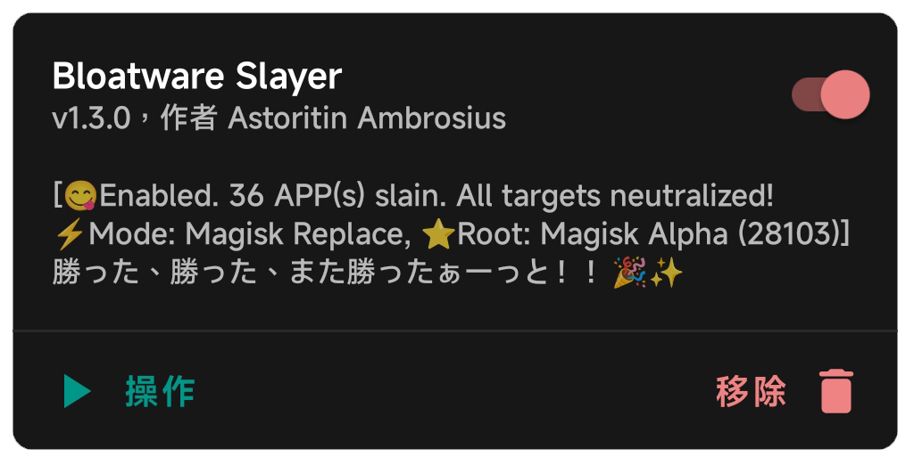
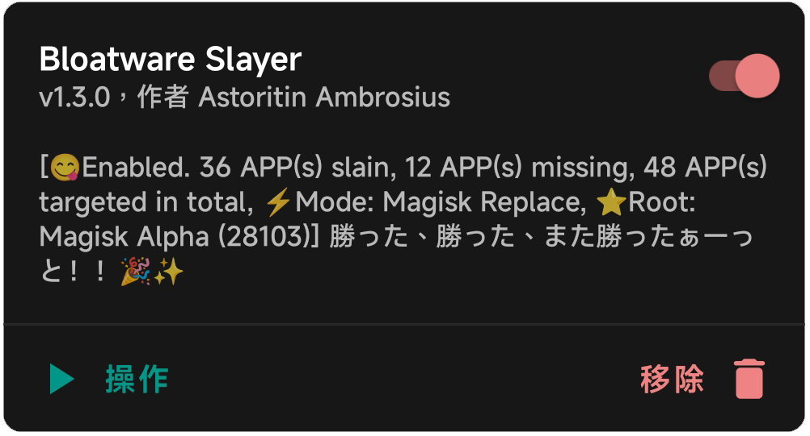

[English](README.md) | 简体中文

# **干掉预装软件**

一个无需修改 system 分区即可移除预装软件的 Magisk 模块 / A Magisk module to remove bloatware in systemlessly way

## 支持的 Root 方案

[Magisk](https://github.com/topjohnwu/Magisk) (推荐!) 丨 [KernelSU](https://github.com/tiann/KernelSU) (推荐!) 丨 [APatch](https://github.com/bmax121/APatch) (仅理论上支持，未经实际测试)

## 详细信息

Bloatware Slayer 通过 Magisk、KernelSU 和 APatch 的特定挂载方法，以 Systemless 的方式删除预装软件，以下是大致步骤：

1. 安装 Magisk / KernelSU / APatch
2. 下载并安装本模块
3. 为了获得预装软件所在的目录/文件夹，你需要提前做好功课：例如使用 [App Manager](https://github.com/MuntashirAkon/AppManager)，或使用Root Explorer、MiXplorer在 `/system` 处手动寻找并复制预装软件的文件夹名
4. 打开 `/data/adb/bloatwareslayer/target.conf`，并将你通过步骤3获得的预装软件所在的文件夹名放在上面，**一行一个**
5. 保存 target.conf 的更改，并重新启动后查看效果

你可以在模块描述中看到被该模块屏蔽的APP数 (slain)、未找到目录的APP数 (missing)和列表里配置的APP总数 (targeted in total)

例如：我需要卸载小爱同学，那么我会通过 AppManager 查看小爱同学所在的文件夹，得知其名字是 `VoiceAssistAndroidT`，然后将 `VoiceAssistAndroidT` 复制到 `target.conf` ，回车并保存更改后重启设备。

## 注意

1. `target.conf` 支持"#"号注释整行和项目旁存在注释，Bloatware Slayer 不会处理被注释掉的行和空行。
2. Bloatware Slayer 支持自定义路径，例如：`/system/app/MiVideo/`。此时 Bloatware Slayer 会直接处理该自定义路径而不会再扫描其他系统文件夹。
3. 由于现如今绝大多数设备都是 SAR (System-as-root)，你可能在 AppManager 中看到的资源目录名不是 `/system` 开头 (例如  `/product/app/Scanner`)，为了确保挂载生效，请手动在这类路径前面添加 `/system` ，否则 Bloatware Slayer 会直接忽略该路径。
4. 为了节省时间和减少资源消耗，现在`target.conf`会随着每次系统启动自动更新为预装APP对应的系统目录，你可以查阅“配置文件”部分进行了解。
5. 若你看到的资源目录以 `/data` 开头，则说明该APP是安装完ROM后的第一次初始化安装上的，实质上属于用户应用，只是内置于ROM的刷机包的特定目录，不属于目前 Root 方案能直接干涉的范畴。这类应用可以自行卸载，并且只有恢复出厂设置时才可能重新被自动安装，请不要加入到 `target.conf` 中，因为Bloatware Slayer的处理也不会对这类软件生效。

#### Q: 为什么需要我手工复制，而不是模块根据我指定的应用名称或包名自行检测？

1. **应用名称和包名并不可靠，依靠这两点查找应用文件夹的效率太低了**。
对于大多数规范的ROM而言，用除了英文以外的其他语言给系统目录/文件夹命名的概率极低，甚至有不少应用的应用名称跟其所在的系统目录/文件夹名没有任何关系（无论是ROM提供商的疏忽和学艺不精导致的命名细节不规范，还是为了隐藏自己收集用户信息安插的眼线APP的阴暗心思而故意不规范命名）。如果一定要这么匹配，且不说需要大量的数据统计，即使如此，误判率也还是很高。
*举个例子：有个APP名为系统服务，但是其目录/文件夹名为AdPushService，其包名为com.android.adpromote*
2. **至于包名，请阅读 [【已确认不会添加的功能：检测包名 / Detecting packages name is permanently off the table】](https://github.com/Astoritin/Bloatware_Slayer/issues/6#issuecomment-2693035556)**。
3. 虽然该模块是在 Systemless (不修改系统) 的情况下运行，但是**你始终需要知道并确定自己正在做的事情**，你必须知道自己需要屏蔽掉哪些系统 APP，**而不是照搬别人的列表，出问题了就把责任全部推给本 Magisk 模块**。

## 配置文件

自 v1.2.1 起， Bloatware Slayer 支持手动启用或禁用以下功能，如有需求请打开配置文件`/data/adb/bloatwareslayer/settings.conf`查看并修改。

1. **`brick_timeout`**：设定判断设备变砖的时限(Timeout)，要求正整数，以秒为单位。
如果不在`settings.conf`中指定，则默认值是`300`秒(5分钟)，`settings.conf`内的默认值为180秒(3分钟)。
2. **`disable_module_as_brick`**：设定是否在触发设备变砖时自动禁用该模块。默认情况下为`true`(启用)，你也可以设置为`false`以禁用该功能。
若禁用，则模块在检测到设备变砖时就**只会跳过挂载而不会自我禁用**，在排除`target.conf`中的不稳定项目后即可自行重新启动，无需再进入Root管理器重新启用本模块。
3. **`auto_update_target_list`**：每次启动时是否更新 target.conf 中的项目为预装应用所在路径，默认情况下为`true`(启用)以加快下次系统的启动速度。
如果你不希望`target.conf`被模块自动更新掉，想保留自己添加的注解或者保留未找到的项目，则可以设定为`false`。
4. ~**`update_desc_on_action`**：在模块被禁用/卸载时更新模块状态描述。是一个没有什么用且会增加消耗的功能，默认`false`(禁用)。~
~如果你希望在点击禁用或卸载按钮后见到提示，那么可以改成`true`启用此功能。~
**注意：该功能已于 1.2.8 起被移除**
5. **`system_app_paths`**: 自定义扫描预装软件所在的系统目录，路径以`/`开头，用空格隔开，例如`system_app_paths=/system/app /system/priv-app`。
6. **`slay_mode`**: Bloatware Slayer 屏蔽预装软件的方式。
`MB (Mount Bind)`, 是在绝大多数ROM内的各种Root方案通用的方法。
`MR (Magisk Replace)`, 是 Magisk 专用的方法。
`MN (Make Node)`, 是 Magisk 28102+、KernelSU 和 APatch 可用的方法。

在`settings.conf`中，默认值为 `MB` (Mount Bind)，因为该方案兼容性最高——只不过不利于 Root 隐藏。如有需求，可手工切换到对 Root 隐藏更友好的 MR 模式或者 MN 模式。

## 日志

日志被保存在 `/data/adb/bloatwareslayer/logs`，你可以查看它并在反馈遇到的问题时提交该日志。

#### 注意

bs_log_core_(时间戳).log 是 Bloatware Slayer 的核心功能相关的日志。
由于此阶段系统尚未初始化完毕，你看到的日期可能会非常离谱，请不要介意
bs_log_brickd_(时间戳).log 是 Bloatware Slayer 的救砖功能检测相关的日志。
bs_log_action_(时间戳).log 是 Bloatware Slayer 的操作按钮相关的日志。
反馈问题时，请直接打包整个logs文件夹后上传。

## 救砖

Bloatware Slayer 内置救砖机制，当检测到手机启动时间过长，会自动禁用模块的挂载功能并自动重启
重启后，你会在模块状态上看见相应信息，请自行调整 `target.conf` ，删除不该被禁用的项目后重新启动
默认的等待时长是300秒（5分钟），也就是说 Bloatware Slayer 会在等待5分钟后自我禁用并重新启动。
若你的系统正在更新，请临时禁用或卸载该模块，之后再安装。

#### Q: Bloatware Slayer会破坏我的设备吗？为什么需要救砖手段？

首先，Bloatware Slayer 只是使用了 Magisk 和 KernelSU/APatch 内置的办法，让这些预装 APP 的文件夹设置为空或者被屏蔽掉，从而使系统不再安装和加载这些软件。**模块本身并不会直接修改系统，一旦禁止或卸载本模块，所有的更改均会被还原**，你的系统也不会受到任何损害，正所谓`Systemless（不修改系统）`。
即使如此，有些 APP 不应该也不能被随意卸载或屏蔽。一来是考虑系统稳定性，**部分APP是必须存在才能维护系统正常的运行秩序的APP**——比如说设置和系统界面是在正常生产环境的设备中必须存在的 APP。
不过，**这类 APP 数量其实很稀少**，可能整整100个系统 APP 中只有20~30个 APP 属于这一类，大部分系统 APP 事实上并没有多重要，该动手就动手。
二来，某些品牌厂商（MIUI、Huawei、Google）为了持续收集用户信息，会在预装软件中安插一大批看起来 “十分合理” 但是细究起来就是广告毒瘤和信息收集的 APP (Google Play 服务、Google Assistant、应用商店、SystemHelper、AnalysisCore、Joyose)，**这些 APP 被放在系统内置的白名单内，大部分限制对它们而言无效，甚至一旦系统检测到它们被卸载或不存在，就直接拒绝开机或者拒绝提供某些服务。**
如果你将某些 APP 加入了 `target.conf` 但是卡在了开机动画甚至是开机第一屏，**要么这些APP是维持系统正常运行秩序所必须的 APP，要么这些APP就是所谓的“一卸载就罢工”的 APP**。
这个时候无论是排除法还是需要进入系统，就需要救砖手段了，以下是一些救砖建议：
1. 对于 Magisk Alpha，当设备两次无法正常进入系统时，在第三次启动就会自动进入安全模式，并禁用所有模块，此时你可以进入并修改 target.conf
2. 对于 KernelSU / APatch，在开机第一屏到开机动画期间可以连续按下音量减键十次左右（连续按，不是长按）,只要你的设备的 KernelSU 内核将救砖模式的代码编译在内，那么有大概率进入 KernelSU / APatch 的安全模式，所有模块会被禁用
3. 对于支持第三方 Recovery 的设备，当你使用 Magisk 时，你也可以直接使用这类 Recovery 的模块管理界面，轻松禁用 Bloatware Slayer。

## 经过测试的ROM
1. 小米澎湃系统2.0.105.0，安卓15，设备：红米 Note 9 Pro 5G 8+256GB (设备代号gauguin，移植系统)
- Root：Magisk Alpha 28102
2. 小米MIUI12.5.4，安卓10，设备：红米 Note 7 Pro 6+128GB (设备代号violet，原厂系统)
- Root：Magisk Alpha 28102
3. DroidUI-X，安卓14，设备：红米 Note 7 Pro 6+128GB (设备代号violet，类原生系统)
- Root: KernelSU with Magic Mount 1.0.3
- Root: KernelSU with OverlayFS 0.9.5
4. Flyme 8.0.5.0A, 安卓7.1.2, 设备: 魅蓝 Note 6 4+64GB (设备代号m1721, 原厂系统)
- Root: Magisk Lite 25205
5. Derpfest 15.1 Stable，安卓15，设备：红米 Note 7 Pro 6+128GB (设备代号violet，类原生系统)
- Root: Magisk Alpha 28103

## 帮助与支持
如果遇到问题，请点击 [此处](https://github.com/Astoritin/BloatwareSlayer/issues) 提交反馈
欢迎 [提交代码](https://github.com/Astoritin/BloatwareSlayer/pulls)，让该模块变得更好
